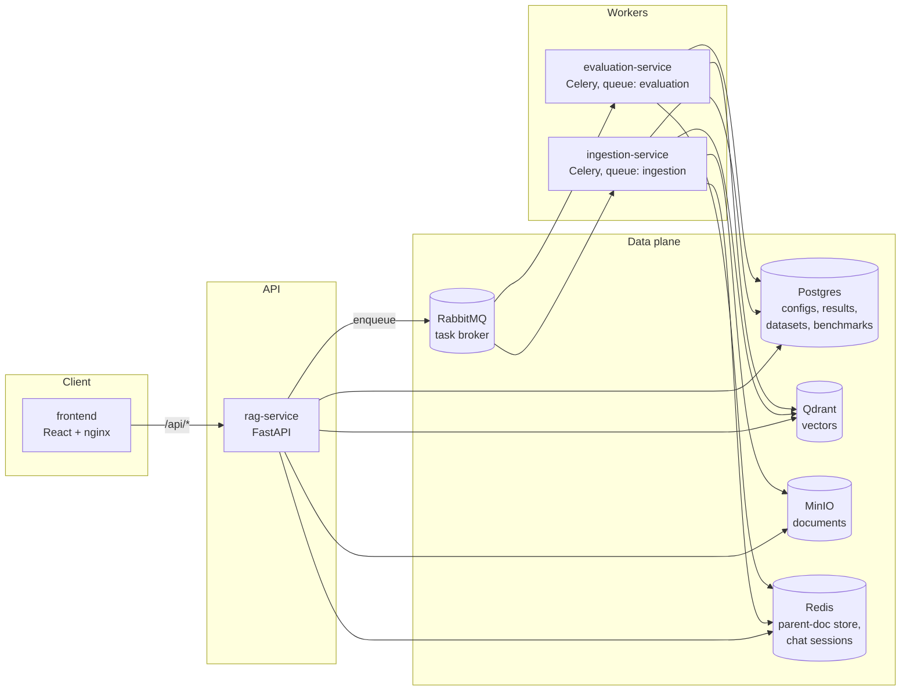

# RAG Lab

A laboratory for building, querying, comparing, and benchmarking Retrieval-Augmented Generation (RAG) pipelines. Configure every stage of a pipeline — chunking, indexing, query translation, retrieval, post-retrieval, generation — then measure how configuration choices affect answer quality with LLM-as-judge evaluation.

Deployment manifests live in the companion GitOps repo: [RAG-Lab-Infra](https://github.com/Silverd087/RAG-Lab-Infra).

## Features

- **Pipeline builder** — step-by-step wizard covering all six RAG stages, with presets-compatible config stored as JSONB. Pipelines can be edited after creation (everything except indexing, which is tied to the vector collection) and deleted with full cleanup of their Qdrant collection, MinIO documents, and Redis docstore.
- **Document ingestion** — PDF upload to MinIO, parsed with `unstructured`, chunked and embedded by a dedicated Celery worker; pipeline status transitions (`draft → ingesting → ready / error`) drive the UI.
- **Query playground** — chat-style interface with token streaming (SSE), per-stage latency breakdown, retrieved-chunk traces with relevance/rerank scores, query-translation transparency (HyDE, multi-query, step-back), session history, and at-a-glance pipeline configuration.
- **Side-by-side comparison** — ask two pipelines the same question; compare answers, per-stage latency, retrieved chunks (with "only in this pipeline" diffing), and reference-free DeepEval scores (faithfulness, answer relevancy).
- **Golden datasets** — CRUD for question/ground-truth pairs used as benchmark references.
- **Benchmarking** — run any number of pipelines against a dataset; a Celery chord fans out one evaluation task per pipeline and aggregates results. Scores four DeepEval metrics (faithfulness, answer relevancy, contextual precision, contextual recall) with partial-failure reporting: one failed dataset item is skipped and reported, not fatal to the run.
- **Observability** — Prometheus-format metrics (`/metrics`), liveness (`/healthz`) and dependency-aware readiness (`/readyz`) endpoints. The Compose stack only exposes these endpoints; a Prometheus + Grafana stack that scrapes them is provided separately in [RAG-Lab-Infra](https://github.com/Silverd087/RAG-Lab-Infra) for the k8s deployment.

## Architecture



| Service | Role |
|---|---|
| `frontend` | React SPA served by nginx; proxies `/api/` to `rag-service`, with buffering disabled for the SSE streaming route |
| `rag-service` | FastAPI app: pipeline/dataset/benchmark CRUD, query execution with streaming, comparison orchestration |
| `ingestion-service` | Celery worker (`ingestion` queue): downloads PDFs from MinIO, parses, chunks, embeds into Qdrant |
| `evaluation-service` | Celery worker (`evaluation` queue): runs RAG pipelines against golden datasets and scores them with DeepEval |
| Postgres | Pipeline configs (JSONB), query results and chunk traces, datasets, benchmarks, comparisons |
| Qdrant | One collection per pipeline (`collection_<pipeline_id>`), dense / sparse / hybrid |
| MinIO | Uploaded documents under `pipelines/<pipeline_id>/` |
| Redis | Parent-document docstore (`docstore_<pipeline_id>/*`) and session state |
| RabbitMQ | Celery broker (separate `ingestion` and `evaluation` queues) |

## Tech stack

**Backend** — Python 3.13, FastAPI, SQLAlchemy (async + sync), Celery, LangChain (Google Gemini, Anthropic Claude, Voyage AI, Cohere, HuggingFace), Qdrant, DeepEval, `uv` for dependency management.

**Frontend** — React 19, TypeScript, Vite, TanStack Query, React Router, CSS Modules (dark theme, custom design tokens).

## Repository layout

```
backend/
  config.py               # pydantic-settings, reads .env
  src/
    main.py               # FastAPI app, health/readiness/metrics
    celery_app.py         # Celery app + queues
    api/
      routers/            # pipelines, documents, query, compare, datasets, benchmarks
      task.py             # Celery tasks: ingestion, evaluation, benchmarking
      schema.py           # request/response models
    rag/
      core.py             # provider factories (LLMs, embeddings, rerankers, vector stores)
      pipeline.py         # end-to-end pipeline execution
      steps/              # query_translation, retrieval, post_retrieval, generation
      ingest.py           # document parsing + indexing
    database/             # async/sync sessions, SQLAlchemy models
    storage/              # MinIO client
  tests/
    units/                # no external dependencies
    integration/          # need a Postgres with a RagLabTest database
frontend/
  src/
    routes/               # pipelines, query, compare, benchmark, datasets pages
    components/           # design-system components (Button, Field, Skeleton, ...)
    lib/                  # API client, types, formatting helpers
  nginx.conf              # SPA serving + API/stream proxy
compose.yaml              # full local stack
.github/workflows/        # backend + frontend CI (test, build, publish, GitOps bump)
```

## Setup

### Prerequisites

- [Docker](https://docs.docker.com/get-docker/) with Compose (everything below runs through it; no local Python/Node install is required just to try the app)
- API keys, one per provider you intend to use:
  - [Google AI Studio](https://aistudio.google.com/apikey) — Gemini generation + embeddings
  - [Anthropic Console](https://console.anthropic.com/settings/keys) — Claude generation
  - [Voyage AI](https://dashboard.voyageai.com/api-keys) — embeddings for Anthropic-provider pipelines
  - [Cohere](https://dashboard.cohere.com/api-keys) — reranking

Only needed for **local development outside Docker** (see [Local development](#local-development)):

- Python 3.13 with [uv](https://docs.astral.sh/uv/getting-started/installation/)
- Node.js 20+ with npm

### Clone the repo

```bash
git clone https://github.com/Silverd087/RAG-Lab.git
cd RAG-Lab
```

## Getting started

### 1. Configure environment

Create `backend/.env` (consumed by the backend services **and** by the MinIO/RabbitMQ containers):

```env
# LLM / embedding providers
GOOGLE_API_KEY=...
ANTHROPIC_API_KEY=...
VOYAGE_API_KEY=...
COHERE_API_KEY=...

# Postgres
POSTGRES_USER=postgres
POSTGRES_PASSWORD=...        # must match secrets/db_password.txt
POSTGRES_HOST=postgres
POSTGRES_DB=RagLab
POSTGRES_TEST_DB=RagLabTest

# MinIO
MINIO_ENDPOINT=minio:9000
MINIO_ROOT_USER=...
MINIO_ROOT_PASSWORD=...
MINIO_BUCKET_NAME=rag-documents

# Infra URLs
QDRANT_URL=http://qdrant:6333
REDIS_URL=redis://redis:6379
RABBITMQ_URL=amqp://admin:<password>@rabbitmq:5672//
RABBITMQ_DEFAULT_USER=admin
RABBITMQ_DEFAULT_PASS=<password>
```

The Postgres container reads its password from a Docker secret — create it too:

```
secrets/db_password.txt      # same value as POSTGRES_PASSWORD
```

### 2. Run the stack

```bash
docker compose up -d --build
```

| URL | What |
|---|---|
| http://localhost:3000 | RAG Lab UI |
| http://localhost:8000/docs | API docs (Swagger) |
| http://localhost:8000/metrics | Metrics endpoint (Prometheus text format — no Prometheus server is bundled in Compose; scrape it yourself or see [RAG-Lab-Infra](https://github.com/Silverd087/RAG-Lab-Infra)'s `monitoring/` for the Prometheus + Grafana setup used in the k8s deployment) |
| http://localhost:9001 | MinIO console |
| http://localhost:15672 | RabbitMQ management |
| http://localhost:6333/dashboard | Qdrant dashboard |

### 3. First pipeline

1. **Pipelines → New pipeline** — walk through the wizard (a baseline: recursive chunking, Google embeddings, dense retrieval, no reranker, Gemini Flash).
2. Open the pipeline → **Documents** → upload a PDF and wait for status `ready`.
3. **Query** — chat with the pipeline and inspect retrieved chunks and latency.
4. **Datasets** — create a golden Q/A set; **Benchmark** — score pipelines against it.

## Local development

Backend (uses [uv](https://docs.astral.sh/uv/)):

```bash
cd backend
uv sync
uv run uvicorn src.main:app --reload      # needs the data services from compose running
```

Frontend (Vite dev server proxies `/api` to `localhost:8000`):

```bash
cd frontend
npm install
npm run dev
```

## Testing

Backend tests run on `pytest` with `pytest-cov` (branch coverage, `--cov-report=term-missing` + HTML):

| Suite | Tests | Coverage | External deps |
|---|---|---|---|
| `tests/units` | 119 | 68% branch coverage of `src` | None — provider API keys and datastore creds are stubbed in `tests/conftest.py`; LLM calls go through LangChain's `FakeMessagesListChatModel` and `unittest.mock` (`MagicMock`/`AsyncMock`) instead of hitting real providers |
| `tests/integration` | 155 | not measured standalone (needs a live `RagLabTest` Postgres to run) | Real Postgres (`RagLabTest` database, truncated between tests via an autouse fixture in `tests/integration/conftest.py`); requests go through `httpx.AsyncClient` + `ASGITransport` against the FastAPI app in-process. LLM/embedding providers are still mocked — no real API calls or costs |

No mocking is shared across test runs — the mocked env vars are process-local (`os.environ.setdefault`), so unit tests never accidentally hit a real API even if real keys are present in `backend/.env`.

The frontend has no automated test suite yet; `npm run build` (which runs `tsc -b`) and `npm run lint` are the current correctness gates.

```bash
# Backend — unit tests (no external services needed; env is mocked)
cd backend && uv run pytest tests/units

# Backend — integration tests (need Postgres with a RagLabTest database)
uv run pytest tests/integration

# Frontend
cd frontend && npx tsc --noEmit && npm run lint && npm run build
```

## Pipeline configuration reference

| Stage | Options |
|---|---|
| Chunking | `recursive`, `fixed`, `sentence`, `semantic`; chunk size / overlap; optional parent-document retriever (small chunks indexed, parent returned) |
| Indexing | Provider: Google (`gemini-embedding-001`, …), Anthropic via Voyage (`voyage-3-large`, …), HuggingFace (local sentence-transformers). **Immutable after creation** — the Qdrant collection is built with these settings |
| Query translation | Multi-query, HyDE, step-back prompting (combinable) |
| Retrieval | `dense`, `sparse` (BM25), `hybrid`, `mmr`; top-k |
| Post-retrieval | Reranker: none, cross-encoder (local), Cohere, reciprocal rank fusion (requires multi-query); top-n; long-context reorder |
| Generation | Provider: Google (Gemini) or Anthropic (Claude); custom prompt template with `{context}` / `{question}` |

## Evaluation

Evaluation uses [DeepEval](https://deepeval.com/) with the pipeline's own generation LLM as judge:

- **Comparisons** (no ground truth): faithfulness, answer relevancy.
- **Benchmarks** (against a golden dataset): faithfulness, answer relevancy, contextual precision, contextual recall — averaged across dataset items, with per-item failures skipped and reported (`completed_with_errors` status, partial-error tags in the UI).

In Celery workers DeepEval runs synchronously (`async_mode=False`) — event loops are created per task, and async HTTP clients must not outlive the loop that opened their connections (see `get_llm`'s per-event-loop cache in `backend/src/rag/core.py`).

## Operational endpoints

| Endpoint | Purpose |
|---|---|
| `GET /healthz` | Liveness — process is up |
| `GET /readyz` | Readiness — checks Postgres, Qdrant, MinIO, Redis, RabbitMQ; 503 when any is down |
| `GET /metrics` | Prometheus metrics (via `prometheus-fastapi-instrumentator`) |

## CI/CD

Two GitHub Actions workflows, path-filtered:

- **Backend CI** — unit tests → integration tests (Postgres service container) → on push to `dev`: build and push `ghcr.io/silverd087/raglab-backend:sha-<short>` → bump the image tag in [RAG-Lab-Infra](https://github.com/Silverd087/RAG-Lab-Infra) `overlays/dev` via `kustomize edit set image`.
- **Frontend CI** — typecheck → lint → build → same publish + GitOps bump for `raglab-frontend`.

Argo CD watches the infra repo and syncs the new tags into the cluster — see the infra repo's README for the deployment side.
